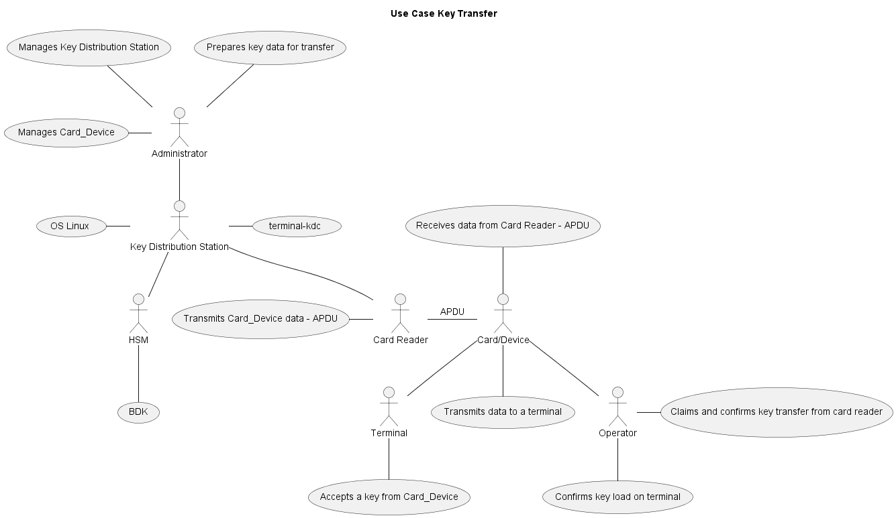
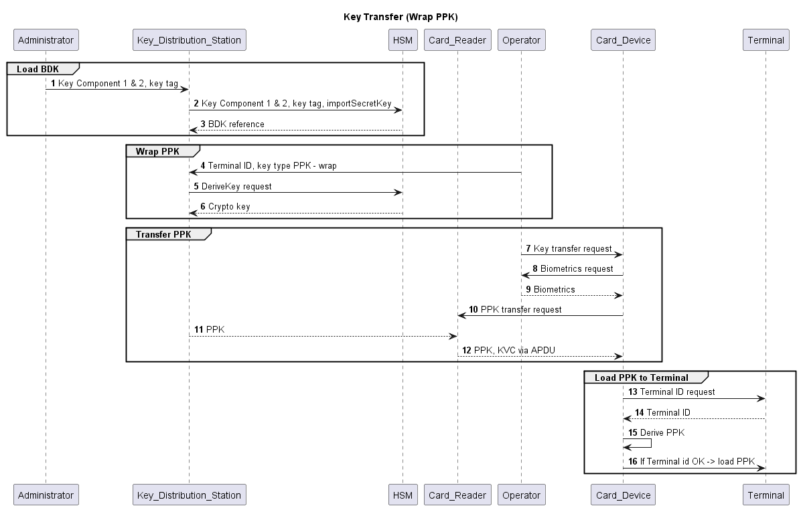
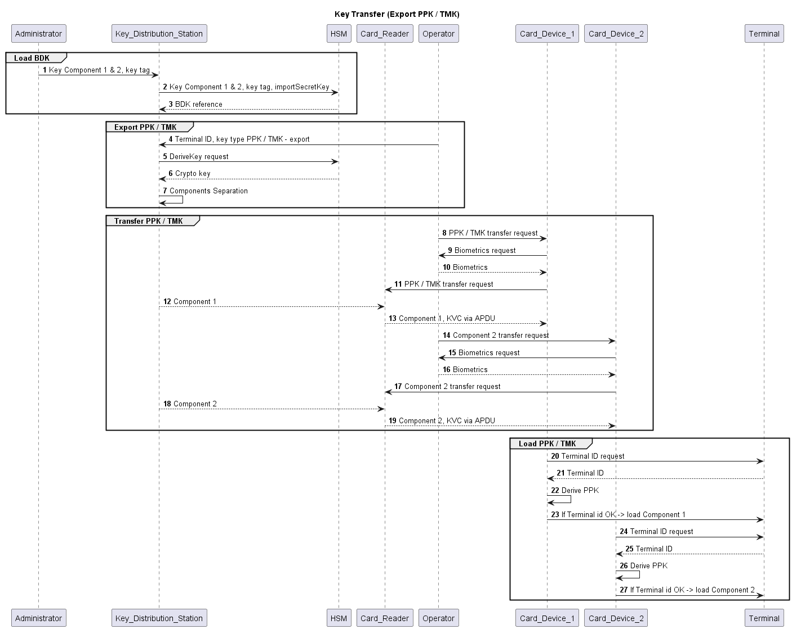
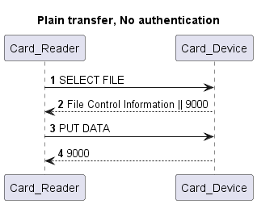
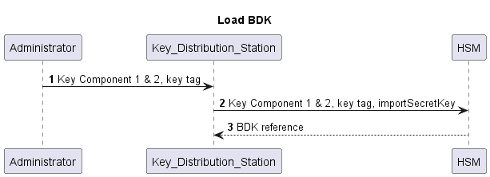
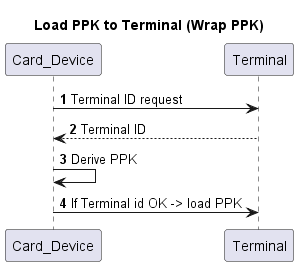
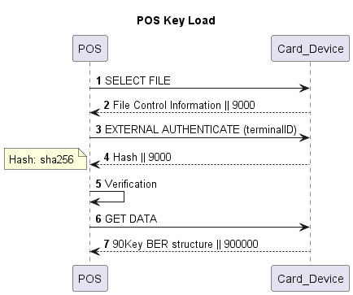

+++ {"part": "abstract"}

В Система за пренос на криптографски данни се осъществява пренос данни на криптографски ключове.  

+++

## Use Case   

(wrapppk)=
## Key Transfer

(exp)=
## Export PPK-TMK

## Plain Transfer

(loadbdk)=
## Load BDK

(load-term)=
## Load PPK Terminal Wrap PPK

(plain_load_terminal)=
## Plain Load Terminal

